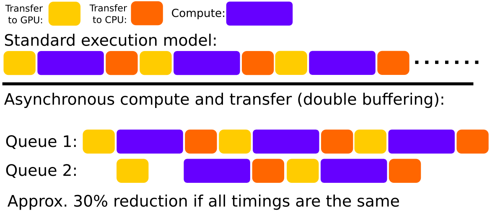

# Summary

Quantitative MRI (qMRI) aims at identifying the underlying physical tissue parameters 
that define the contrast in an imaging experiment. Contrary to conventional MRI examinations, qMRI
offers insights into diseases based on absolut quantitative values instead of relative intensity changes in arbitrary units, thus, 
potentiall simplifying comparisons between different medical sites as well as giving the opprotunity to
classify the severity or progression of certain diseases. Under certain simplifications
analytical expressions are available, describing the relation between image
intensity and physical properties of tissue. Using several measurements with 
varying sequence settings (e.g. flip-angle, repetition time, echo time) it is possible to solve the associated inverse problem
of identifying these tissue parameters.

The increased measurement time due to the repeated imaging experiments of such studies is typically tackeld by 
subsampling the data acquisiton, i.e. acquiring less data than the Nyquist-Shannon theorem implies. However, the reduced amount of data as well 
as the typical non-linear structure of the associated inverse problem require dedicated numerical solution strategies [@Donoho2006; @Lustig2007; @Block2009; @Doneva2010; @Sumpf2012; @Roeloffs2016] wich are commonly known as model-based reconstruction. However, the involved non-linear iterative reconstruction techniques often lead to prolonged reconstruction times. An effect that gets even more demanding if 3D image volumes are of interest. 

In recent years the upsurge of computationally powerful GPUs has led to a variety of
GPU based implementations to speed up computation time of highly parallelizeable operations 
(e.g., the Fourier transformation in MRI [@Knoll2014g]). However, as memory is
a scarce resource, most reconstruction and fitting algorithms are applied in a slice-by-slice fashion to 
the volumetric data by taking a Fourier transformation along a fully sampled acuqisition direction, effectively yielding a set of 2D problems.
Subsequently the additional information in form of the third dimension of volumetric data is neglected.

To utilize full 3D information in advanced reconstruction and fitting algorithms on memory limited GPUs, 
special solutions strategies are necessary to leverage the speed advantage, e.g., hide memory latency of repeated transfers to/from the GPU to host memory.
This can be achieved using asynchronous execution strategies but correct synchronization of critical operations can be error prone.
To this end, a simple to use toolbox is of high interest for qMRI.

# Statement of need 

`PyQMRI` aims at reducing the required reconstruction time by means of a
highly parallelized `PyOpenCL` [@Klockner2012a] implementation of a state-of-the-art fitting algorithm 
while maintaining the easy-to-use properties of a Python package.
In addition to fitting small data (e.g. 2D slices) completely on the GPU an efficient
double-buffering based solution strategy is implemented. Double-buffering 
allows to overlap computation and memory transfer from/to the GPU, thus
hiding the associated memory latency. By overlapping the transfered blocks
it is possible to pass on 3D information utilizing finite differences based
regularization strategies [@Maier2019d]. \autoref{fig:db} shows a schematic of the employed double-buffering scheme.

Currently 3D acuqisitions with at least one fully sampled dimension can
be reconstructed on the GPU, including stack-of-X acquisitions or 3D Cartesian
based imaging. Of course 2D data can be reconstructed as well. Fitting is based
on an iterativly regularized Gauss-Newton (IRGN) approach combined with 
a primal-dual inner loop. Regulariaztion strategies include total variation (TV)
and total generalized variation (TGV) using finite differences gradient operations.

`PyQMRI` comes with several pre-implemented quantiative models. In addition,
new models can be introduced via a simple text file, utilizing the power
of `SymPy` to generate numerical models as well as their partial derivatives in Python. Fitting can be initiated via a CLI or by importing the package
into a Python script. To the best of the authors knowledge `PyQMRI`
is the only availabel Python toolbox that offers real 3D regularization 
in an iterative solver for inverse quantitative MRI problems
and for arbitrary large volumetric data while simultaneously utilizing the computation
power of recent GPUs. Due to `PyQMRI`s OpenCL backend no vendor specific hardware restrictions are present, however,
current limitations of the `gpyfft` backage used to wrap the `clfft`, constrain the use to GPU devices only.
A switch to other `clfft` wrappers might solve this limitation in future releases but `gpyfft` is the only one that currently supports fast non-power-of-two transformations up to 13.

`PyQMRI` and its precedors have been succesfully used in several scientific
publications. Examples include T1 quantification from subsampled radial FLASH 
and inversion-recovery Look-Locker data [@Maier2019c], diffusion tensor imaging [@Maier2020a], 
and on-going work on aterial spin labeling [@Maier2020b; @Maier2020c], as well as low-field T1 mapping using field cycling MRI. 

# Algorithmic
The general problem structure dealt with in `PyQMRI` is as follows:

$$
\underset{u,v}{\min}\quad 
\frac{1}{2}\|A(u) - d\|_2^2 
+\nonumber \gamma( \alpha_0\|\nabla u - v\|_{1,2,F} + 
\alpha_1\|\mathcal{E}v\|_{1,2,F})
$$
which includes a non-linear forward operator ($A$), mapping the parameters $u$ to (complex) data space $d$, and non-smooth regularization due to 
the $L^1$-norms of the T(G)V functional [@Bredies2010; @Knoll2011]. Setting $\alpha_1=0$ and $v=0$ the problem
becomes simple TV regularization [@Rudin1992]. The gradient $\nabla$ and symmetrized gradient $\mathcal{E}$ operators are implemented using finite differences.
To further improve the quality of the reconstructed parameter maps `PyQMRI` uses a Frobenius norm to join spatial
information from all maps in the T(G)V functionals [@Bredies2014; @Knoll2017a]. Box constraints, limiting each unknown paramater in $u$ to a physiological meaningful range,
can be set in conjunction with real or complex value constraints.

Following the Gauss-Newton approach a sequence $k$ of linearized sub-problems of the form
$$
\underset{u,v}{\min}\quad 
\frac{1}{2}\|\mathrm{D}A\rvert_{u=u^{k}} u-\tilde{d}^k
\|_2^2 + \nonumber\gamma_k(\alpha_0\|\nabla u - v\|_{1,2,F} + \alpha_1|\|\mathcal{E}v\|_{1,2,F}) +
\nonumber \frac{\delta_k}{2}\|u-u^k\|_{M_k}^2.
$$
needs to be solved to find a solution of the overall problem. The subproblems can be recast into a saddle-point structure by application of the Fenchel duality
\begin{equation}\label{eq:PD}
\underset{u}{\min}\,\underset{y}{\max}~ \left<\mathrm{K}u,y\right> + G(u) - 
F^*(y),
\end{equation}
and solved utilizing a well established primal-dual algorithm [@Chambolle2011]
 combined with a line-search [@Malitsky2018] to speed-up convergence. Constant terms, stemming from the linearization, are precomputed and fused with the data $d$, yielding $\tilde{d}^k$.
The inclusion of the additional $L^2$-norm penalty improves convexity of the subproblem and resembles a Levenberg-Marquat update for $M_k=diag(\mathrm{D}A\rvert_{u=u^{k}}^T
\mathrm{D}A\rvert_{u=u^{k}})$. A graphical representation of the involved steps is given in \autoref{fig:pipeline}. The regularization weights, regularization type (TV/TGV), and the number of outer and inner iterations can be changed using a plain text configuration file.

# Acknowledgements

Oliver Maier acknowledges grant support from the Austrian Academy of Sciences under award DOC-Fellowship 24966.

The authors would like to acknowledge the NVIDIA Corporation Hardware grant support.

# References
